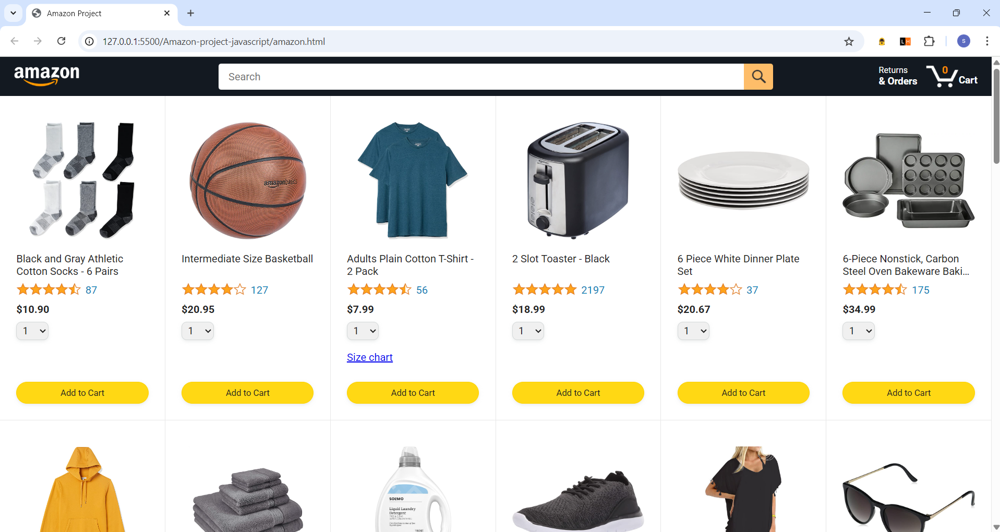
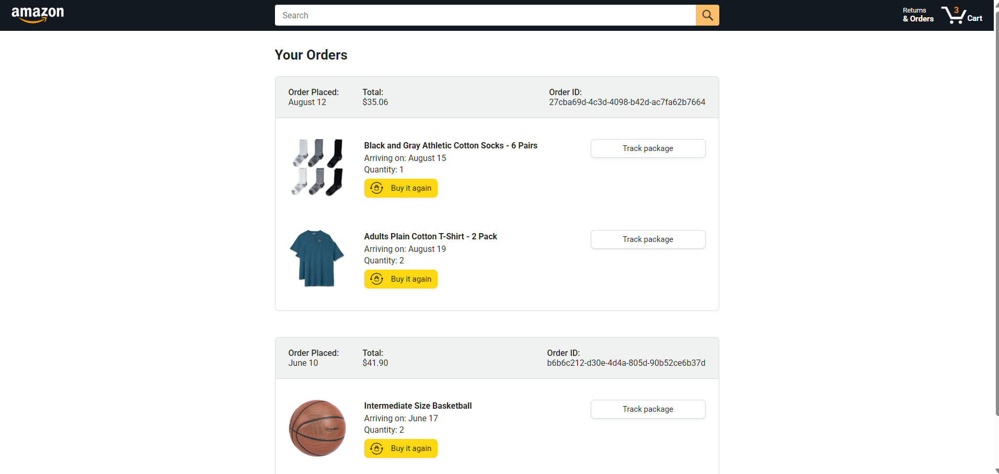
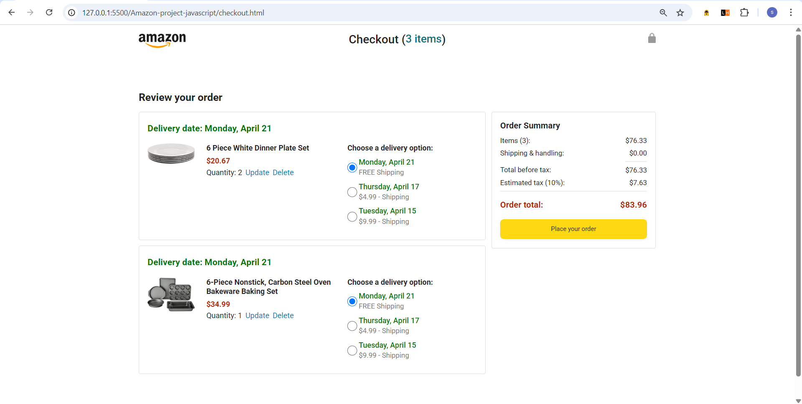
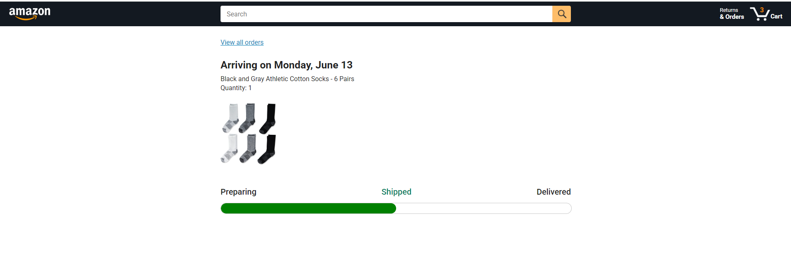

# 🛍️ Amazon Clone - JavaScript E-Commerce Project

[](https://youtu.be/WVb52ZPLZuw?si=aljUTxSrJb0BLRdZ)  
<!-- Replace with your actual screenshot path and demo video link -->

## ✨ Features
- **Product Catalog**  (items with ratings)
- **Cart System** (add/remove/update quantities)
- **Checkout Flow** with 3 delivery options
- **Order Tracking** with progress bar
- **Mobile-Friendly** responsive design

## 🛠️ Tech Stack
```javascript
// Frontend
HTML5 • CSS3 (Grid/Flexbox) • Vanilla JavaScript (OOP)

// State Management
LocalStorage API • JSON Data

// Testing
Jasmine (Unit Tests)

git clone https://github.com/YOUR_GITHUB_USERNAME/amazon-project-javascript.git
cd amazon-project-javascript
# Just open amazon.html in browser (no build needed)

## 📸 Screenshots

| Page        | Preview |
|-------------|---------|
| **Cart**     |  |
| **Checkout** |  |
| **Products** |  |
